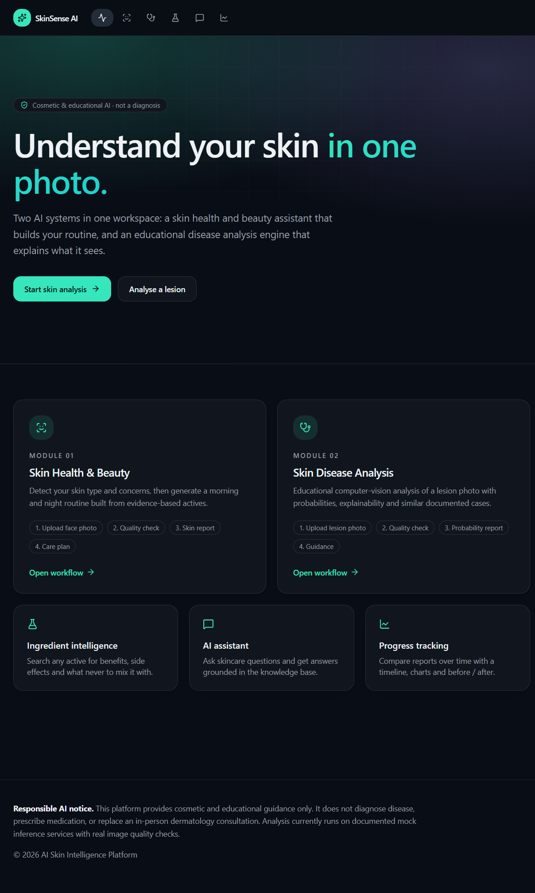
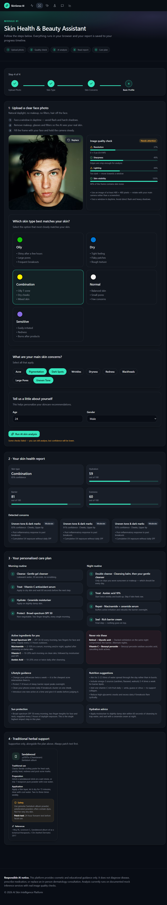
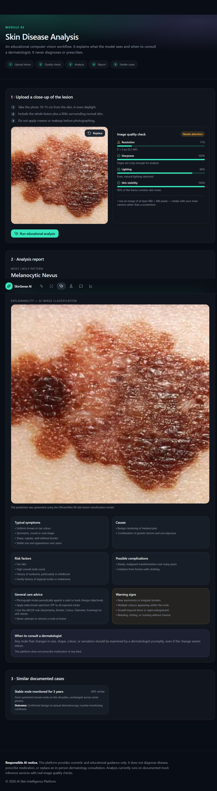
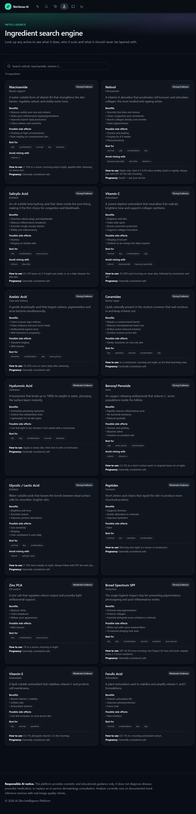
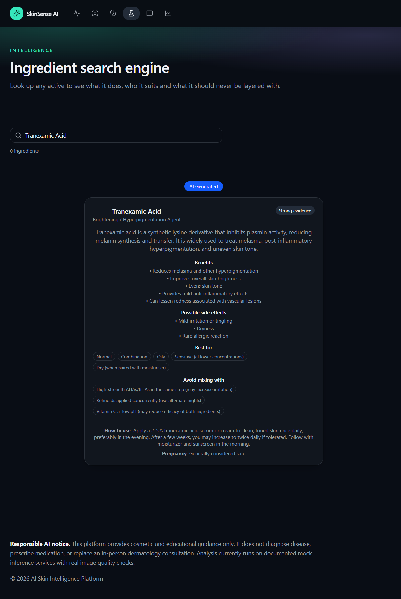
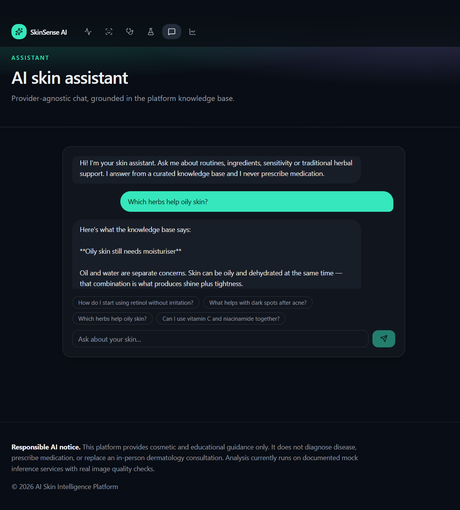
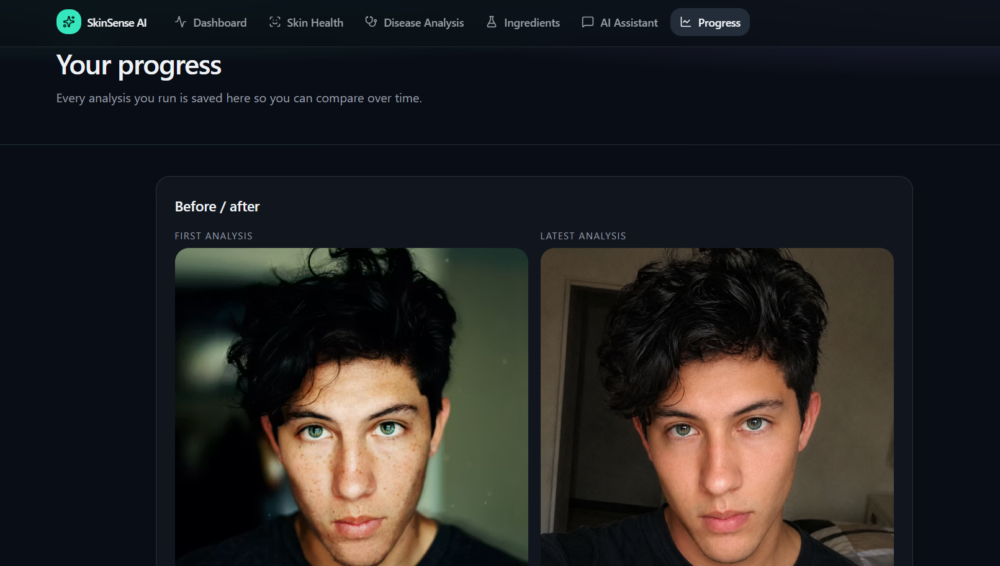

# 🩺 SkinSense AI


> **AI-Powered Skin Intelligence Platform**

### 🚦 Project Status

🚀 **Active Development**

### 🧩 Current Modules

- AI Skin Health & Beauty Assistant
- AI Skin Disease Analysis
- Ingredient Intelligence
- LLM-powered AI Assistant
- Traditional Herbal Knowledge
- Progress Tracking

> **Disclaimer:** SkinSense AI is intended for educational and informational purposes only. It does not replace professional medical advice, diagnosis, or treatment.

---

# 📖 Project Description

SkinSense AI is a **complete AI platform** for skincare and dermatology assistance — not a single model wrapped in a UI, but a modular application that integrates several distinct AI technologies into one coherent product.

The platform brings together:

- 🧠 **Artificial Intelligence & Machine Learning** — as the foundation of every analysis module
- 👁️ **Computer Vision & Deep Learning** — for image-based skin disease classification
- 💬 **Large Language Models (LLMs)** — for natural language, AI-assisted skincare guidance
- 📚 **Knowledge-Based Systems** — structured ingredient and herbal knowledge bases
- 🎯 **Intelligent Recommendation Systems** — rule-based, explainable skincare guidance
- 🔍 **Explainable AI (XAI)** — predictions and recommendations that come with reasoning, not just labels
- 🧩 **Modular AI Architecture** — every AI capability is an independent, swappable service
- 🫶 **Human-Centered AI** — designed around clarity, education, and user trust, not black-box output

Each of these pieces — the disease classification pipeline, the LLM-powered assistant, the ingredient intelligence engine, and the herbal knowledge base — is built as an independent service. Together, they form a single AI inference and knowledge-support pipeline that takes a user from "I have a skin concern" to a structured, explainable, and educational report.

---

# 🎯 Project Objectives

SkinSense AI was built with the following goals in mind:

- Provide **AI-assisted decision support** for everyday skincare, grounded in structured, explainable logic
- Support **disease understanding**, not diagnosis — helping users learn about visible skin conditions through deep learning-based classification
- Deliver **ingredient intelligence** that goes beyond a static glossary, powered by an LLM
- Offer **educational dermatology support** for informational purposes only
- Demonstrate a **modular AI architecture** that can scale with new models, services, and knowledge sources
- Combine **computer vision, LLMs, and knowledge-based systems** into a single, coherent AI platform
- Maintain a **user-friendly, accessible experience** across the entire application

---

# 🔎 Project Overview

- A complete, multi-module AI platform — not a single-model demo
- Modular, service-oriented AI architecture
- Deep learning–based skin disease classification pipeline
- LLM-powered AI Assistant for natural language guidance
- Structured, knowledge-based ingredient and herbal intelligence
- Explainable AI design across every analysis module
- Responsive, modern UI with dark mode support
- REST API backend built on FastAPI

---

# 🌟 Project Highlights

- 🧠 **AI Disease Detection** — deep learning–based skin lesion classification with EfficientNet-B0
- 🤖 **LLM-powered AI Assistant** — natural language skincare and ingredient guidance
- 🧪 **Ingredient Intelligence** — structured, compatibility-aware, LLM-enhanced ingredient database
- 🌿 **Traditional Herbal Knowledge** — referenced, safety-conscious herbal practices
- ⚡ **FastAPI Backend** — fast, typed, dependency-injected service layer
- 🎨 **Modern React Frontend** — TypeScript, Tailwind CSS, and Framer Motion
- 📱 **Responsive UI** — consistent experience across devices
- 🔍 **Explainable AI Workflow** — every prediction ships with reasoning, not just a label
- 🧩 **Modular AI Architecture** — each AI service is independent and individually extensible


---

# # 🖼️ Screenshots

## 🏠 Home



---

## 🌿 AI Skin Health & Beauty Assistant



---

## 🩺 AI Skin Disease Analysis



---

## 🧪 Ingredient Intelligence



---

## 🤖 AI Ingredient Search



---

## 🌱 Traditional Herbal Knowledge


---

## 💬 AI Assistant



---

## 📈 Progress Tracking


---

# ✨ Key Features

## 🌿 AI Skin Health & Beauty Assistant

Analyze facial skin and receive personalized skincare recommendations.

### Features

- Facial image upload
- Image quality assessment
- Skin type analysis
- Skin concern detection
- Severity estimation
- Confidence scoring
- Personalized skincare routines
- Morning & night care plans
- Lifestyle recommendations
- Hydration guidance
- Sun protection advice
- Nutrition recommendations
- Progress tracking
- Report history

---

## 🩺 AI Skin Disease Analysis

Analyze visible skin conditions through an intelligent disease analysis workflow.

### Features

- Lesion image upload
- Intelligent image quality validation
- Disease prediction workflow
- Confidence score visualization
- Top prediction analysis
- Educational disease reports
- Risk factor analysis
- Symptom overview
- General care recommendations
- Warning signs
- Similar case visualization
- Explainable AI architecture

---

## 🧪 Ingredient Intelligence

Explore detailed information about skincare ingredients.

Supported ingredients include:

- Niacinamide
- Retinol
- Salicylic Acid
- Vitamin C
- Azelaic Acid
- Ceramides
- Hyaluronic Acid
- Glycolic Acid
- Benzoyl Peroxide
- Peptides

Each ingredient includes:

- Description
- Benefits
- Side effects
- Recommended skin types
- Usage guidelines
- Ingredient compatibility
- Ingredients to avoid combining

---

## 🌱 Traditional Herbal Knowledge

Integrated herbal knowledge inspired by traditional skincare practices.

Each herb includes:

- Image
- Common name
- Malayalam name
- Scientific name
- Traditional applications
- Preparation methods
- Application techniques
- Safety precautions
- Patch test recommendations
- References

---

## 🤖 AI Assistant

Interactive AI assistant capable of helping users understand:

- Skin reports
- Ingredient recommendations
- Skincare routines
- Disease information
- General skincare guidance

---

## 📈 Progress Tracking

Track skin improvements over time.

Features include:

- Historical reports
- Timeline view
- Before & After comparison
- Progress visualization
- Analysis history

---

# 🧠 AI Models & Intelligence

SkinSense AI is a **hybrid AI platform** — it does not rely on one model to do everything. Instead, it combines computer vision, large language models, and structured knowledge systems, each responsible for a distinct part of the experience.

### 👁️ Computer Vision Intelligence

Powers the **AI Skin Disease Analysis** module using deep learning–based image classification.

- **PyTorch** as the deep learning framework
- **EfficientNet-B0** convolutional neural network architecture
- Trained with reference to the **HAM10000** dermatoscopic image dataset — a well-known, publicly documented collection of pigmented skin lesion images spanning multiple diagnostic categories
- Image preprocessing pipeline (resizing, normalization, tensor conversion)
- Image quality assessment before inference (resolution, blur, brightness, subject checks)
- Multi-class skin lesion classification
- Confidence score estimation per prediction
- Explainable output — every prediction is paired with structured, human-readable reasoning (symptoms, risk factors, warning signs) rather than a bare label

### 💬 Large Language Intelligence

Powers the **AI Assistant** and enriches **Ingredient Intelligence** with natural language reasoning.

- **Groq API** as the LLM inference provider
- LLM-powered AI Assistant for natural language interaction
- Skincare guidance generated through prompt-engineered, context-aware queries
- Ingredient explanations generated dynamically rather than served as static text alone
- Report interpretation — helping users understand what a skin health or disease report actually means
- Educational dermatology assistance grounded in the platform's structured knowledge base

### 📚 Knowledge Intelligence

Powers **Ingredient Intelligence**, **Traditional Herbal Knowledge**, and rule-based recommendations.

- Structured ingredient database (compatibility rules, skin-type suitability, usage guidelines)
- Traditional herbal knowledge base (preparation, application, safety, references)
- Rule-based skincare recommendation engine that combines skin analysis results with the knowledge base to generate routines

---

# ⚙️ AI Capabilities

A practical breakdown of what each AI technique contributes to the platform:

| Capability | Applied In | What It Does |
|---|---|---|
| **Computer Vision** | Disease Analysis | Classifies skin lesion images into diagnostic categories |
| **Deep Learning** | Disease Analysis | EfficientNet-B0 CNN performs the underlying image classification |
| **LLM Integration** | AI Assistant, Ingredient Intelligence | Generates natural language guidance and explanations |
| **Prompt Engineering** | AI Assistant | Shapes context-aware, skincare-specific LLM queries |
| **Explainable AI** | Disease & Skin Health Reports | Surfaces symptoms, risk factors, and reasoning alongside every prediction |
| **Knowledge-Based AI** | Ingredients & Herbal Knowledge | Structured, rule-driven facts rather than model hallucination |
| **Intelligent Recommendation Systems** | Skincare Routines | Combines analysis output with the knowledge base to build routines |

---

# 🏗 System Architecture

SkinSense AI follows a modular, service-oriented architecture that separates the user interface from the AI processing layer, allowing each AI capability to evolve independently.

```
                     React Frontend
                           │
                           ▼
                  FastAPI Application Layer
                           │
                           ▼
                 Computer Vision Pipeline
              (EfficientNet-B0 · PyTorch)
                           │
                           ▼
              Large Language Model Layer
                     (Groq LLM)
                           │
                           ▼
                  Knowledge Engine
     (Ingredient DB · Herbal DB · Recommendation Rules)
                           │
                           ▼
                  Structured Reports
           (Disease · Skin Health · Progress)
```

### AI Intelligence Layer

```
AI Intelligence Layer

├── Skin Health Analyzer
├── Disease Analyzer
├── Ingredient Intelligence
├── Herbal Knowledge Engine
├── AI Assistant
└── Report Repository
```

### Data Layer

```
Data Layer

├── JSON Knowledge Base
├── SQLite Database
└── User Reports
```

This architecture keeps every module independent, scalable, and easy to maintain while providing a consistent user experience — an image can flow through the computer vision pipeline, a text query can flow through the LLM layer, and both can draw on the same underlying knowledge engine.

---

# 🛠️ Engineering Highlights

Beyond the AI itself, SkinSense AI is built with production-grade software engineering practices:

- **Modular Software Design** — every AI capability is implemented as an independent service behind an interface, not a single monolithic script
- **Clean REST API Design** — a typed, predictable FastAPI backend with clear request/response contracts
- **Separation of Concerns** — UI, application services, and the AI intelligence layer are cleanly decoupled
- **Component Reusability** — the React frontend is built from composable, reusable UI components
- **Maintainable Architecture** — each service can be tested, debugged, and reasoned about in isolation
- **Extensible AI Modules** — swapping or upgrading a model (e.g. a new classifier, a different LLM provider) requires implementing an existing interface, not rewriting the application

---

# 💻 Technology Stack

### Frontend

- React
- TypeScript
- Tailwind CSS
- Framer Motion
- TanStack Router
- TanStack Query

### Backend

- FastAPI
- Python
- Pydantic
- Dependency Injection

### Artificial Intelligence

- Deep Learning–based disease classification
- Explainable AI (XAI) output design
- Modular AI service architecture

### Machine Learning

- Supervised image classification
- Confidence-based prediction scoring

### Computer Vision

- PyTorch
- EfficientNet-B0
- Image preprocessing pipeline
- Image quality assessment

### Large Language Models

- Groq API
- Prompt-engineered AI Assistant
- LLM-powered ingredient explanations

### Database

- SQLite

### Knowledge Base

- Structured JSON ingredient database
- Structured JSON herbal knowledge base
- HAM10000-referenced dermatological training data (Computer Vision module)

### Developer Tools

- Vite
- npm
- Git & GitHub

### Architecture

- Modular, service-oriented design
- Interface-driven AI service contracts
- Clean separation between UI, application services, and the AI layer

---

# 📁 Project Structure

```
src/
├── components/     # UI components
├── routes/         # Application routes
├── services/       # AI & application services
├── data/           # Structured knowledge base (ingredients, herbs)
├── hooks/          # React hooks
├── lib/            # Shared utilities
└── styles/         # Global styling

models/             # AI model assets
datasets/           # Training/reference datasets
docs/               # Documentation
assets/             # Static assets
```

---

# 🚀 Getting Started

### 1. Clone the repository

```bash
git clone https://github.com/<your-username>/skinsense-ai.git
cd skinsense-ai
```

### 2. Install frontend dependencies

```bash
npm install
```

### 3. Run the frontend (development server)

```bash
npm run dev
```

### 4. Run the backend (FastAPI)

```bash
cd backend
pip install -r requirements.txt
uvicorn app:app --reload
```

> Ensure the backend is running at `http://127.0.0.1:8000` before using the AI Skin Disease Analysis module — the frontend calls this endpoint directly for predictions.

---

# 🎯 Highlights

- Modern AI-driven user experience
- Responsive design
- Dark mode support
- Intelligent image quality assessment
- Skin health analysis workflow
- Skin disease analysis workflow
- Ingredient intelligence
- Traditional herbal knowledge
- Interactive AI assistant
- Progress tracking dashboard
- Modular service architecture
- Clean and scalable codebase

---

# 🛣️ Future Roadmap

Future planned enhancements include:

- User authentication
- Cloud database integration
- Personalized dashboards
- AI-powered skincare chatbot
- Dermatologist consultation support
- Treatment progress analytics
- Mobile application
- Multi-language support
- Cloud model deployment
- Personalized recommendation engine improvements

---

# 🎓 Skills Demonstrated

**AI & Machine Learning**
- Artificial Intelligence
- Machine Learning
- Deep Learning
- Computer Vision
- Large Language Models (LLMs)
- Prompt Engineering
- Explainable AI (XAI)
- AI-Assisted Decision Support
- Knowledge-Based Systems

**Software Engineering**
- Software Architecture
- Modular System Design
- REST API Design
- AI System Integration
- AI Product Development
- Full-Stack Development

**Development**
- FastAPI
- Python
- React
- TypeScript
- State Management
- UI/UX Design

---

# 💡 Why SkinSense AI?

SkinSense AI was built to answer a specific question: what does it look like when computer vision, large language models, and structured knowledge systems work *together*, instead of being demonstrated as isolated, disconnected demos?

The **computer vision pipeline** (PyTorch, EfficientNet-B0, trained with reference to HAM10000) handles what vision models do best — recognizing visual patterns in skin lesion images and producing a classification with a confidence score. The **large language model layer** (Groq) handles what LLMs do best — turning structured data into natural language explanations, answering follow-up questions, and making ingredient and report information genuinely understandable. The **knowledge-based layer** handles what neither vision models nor LLMs should be trusted to improvise — factual, structured, referenced information about ingredients and traditional herbal practices.

Combining these three — rather than trying to force one model to do everything — is what makes SkinSense AI a genuine **hybrid AI platform**: computer vision for perception, an LLM for communication, and a structured knowledge base for grounded, factual accuracy. The result is a system where every module plays to the strength of the AI technique behind it, coordinated through a modular architecture designed to grow.

---

# 👨‍💻 Developer

**Abhishekh Palakkeel**

Artificial Intelligence & Data Science Engineer

**Areas of Interest**

- Artificial Intelligence
- Computer Vision
- Full-Stack AI Development
- Generative AI
- AI Product Engineering
- Human-Centered AI

---

# 📄 License

This project is intended for educational, research, and portfolio purposes.